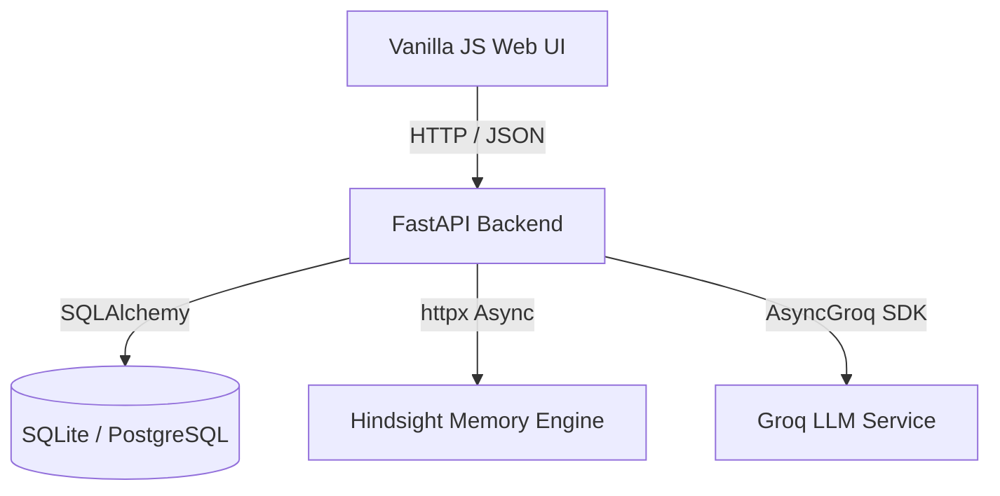

# Meeting Prep Agent

**Meeting Prep Agent** is an AI-powered meeting preparation assistant built to eliminate generic, context-blind meeting preps. By leveraging **Hindsight long-term memory**, the application retains context across multiple conversations, tracks behavioral context, and recalls relevant historical information before high-stakes discussions.

Traditional meeting prep requires manually scanning old notes or transcript summaries that fail to capture the evolving relationship context. Meeting Prep Agent solves this by extracting key topics, sentiment scores, tone, and action commitments from raw transcripts, persisting them in a long-term memory engine, and retrieving that context for strategic preparation.

At the core of the application is **Hindsight**, a long-term memory layer that bridges past interactions with future preparations. Instead of treating every meeting as a cold start, Hindsight retains key meeting insights and recalls them dynamically to generate personalized AI meeting preparation briefs.

---

## 🎬 Demo Flow

For live presentations and demonstrations:

1. **Select a Contact**: Pick a contact (e.g., *Rahul Sharma*) from the toolbar dropdown.
2. **Show Previous Meeting History**: Switch to the **Meetings** view to inspect chronological meeting recaps, dates, tone, and sentiment scores.
3. **Show Hindsight Memory / Context**: Switch to the **Memory** view to review the contact's behavioral profile and the Hindsight flow diagram.
4. **Prepare for the Next Meeting**: Return to **Home** and click **Prepare Me** to trigger `POST /api/v1/agent/chat`.
5. **Show Personalized AI Output**: Inspect the generated preparation brief, quick-summary cards, and the **Hindsight Memory Used** badge.
6. **Explain Retain → Recall → Personalize**: Demonstrate how past meeting transcripts automatically enrich future meeting preparations.

---

## Retain → Recall → Personalize

```
Previous Meeting / Transcript
             ↓
    Groq LLM Extraction
             ↓
    Hindsight Memory Retention (Retain)
             ↓
    Relevant Memory Retrieval (Recall)
             ↓
    Groq Synthesis (Personalize)
             ↓
Personalized AI Meeting Brief
```

- **Retain**: Meeting summaries, key topics, commitments, and behavioral context are sent to Hindsight's `/retain` endpoint as long-term memory.
- **Recall**: The meeting preparation agent retrieves relevant historical memory from Hindsight's `/recall` endpoint when preparing for a meeting.
- **Personalize**: The recalled context is combined with recent meeting history and contact profiles, then passed to the Groq LLM synthesis layer to produce the preparation response.

---

## Key Features

- **Hindsight Long-Term Memory**: Automatic background memory storage (`/retain`) and contextual memory retrieval (`/recall`) across interactions.
- **Meeting Transcript Processing**: Extracts meeting summaries, sentiment scores (-1.0 to 1.0), key topics, tone analysis, and commitments from raw transcripts using Groq.
- **Historical Meeting Timeline**: Maintains a chronological history of meetings per contact.
- **Personalized AI Preparation Briefs**: Synthesizes custom preparation briefs using Groq LLMs, combining Hindsight memories, database history, and contact profiles.
- **Contact & Context Management**: Stores contact profiles and tracks communication patterns, decision preferences, and key topics.
- **Action Commitment Tracking**: Extracts and tracks commitments, assigned owners, due dates, priorities (*High*, *Medium*, *Low*), and status (*Pending*, *Completed*).
- **Light AI Workspace UI**: Single-page web interface built with plain HTML, CSS, and Vanilla JavaScript.

---

## Tech Stack

- **Backend**: Python 3.11, FastAPI, SQLAlchemy, Pydantic, `httpx`, `uvicorn`
- **AI & Memory**:
  - **Groq API**: Primary `openai/gpt-oss-20b` (FAST extraction model, fallback to `llama-3.1-8b-instant`), primary `openai/gpt-oss-120b` (STRATEGIC synthesis model, fallback to `llama-3.3-70b-versatile`)
  - **Hindsight Memory Engine**: Long-term memory platform accessed via REST API (`/retain`, `/recall`)
- **Database**:
  - **SQLite** (Default local database: `DATABASE_URL=sqlite:///./meeting_prep.db`)
  - **PostgreSQL** with `pgvector` container support for production (`docker-compose.prod.yml`)
- **Frontend**: Plain HTML, Vanilla CSS, Vanilla JavaScript (ES6+ without React, TypeScript, Tailwind, or Framer Motion)

---

## Architecture



- **FastAPI Backend**: Manages REST routes, database transactions, and background tasks.
- **GroqService**: Handles LLM extraction (`FAST`) and strategic synthesis (`STRATEGIC`) with fallback logic.
- **HindsightService**: Manages memory retention (`retain`) and semantic memory recall (`recall`).
- **BehavioralAnalyzer & CommitmentExtractor**: Process communication signals and parse action items.
- **PrepBriefGenerator**: Assembles multi-source context (DB + Hindsight + Groq) to generate briefs.

---

## Core API

Registered API v1 endpoints (`backend/main.py`):

| Category | Method | Endpoint | Description |
| :--- | :--- | :--- | :--- |
| **Contacts** | `GET` | `/api/v1/contacts` | List all contacts |
| | `POST` | `/api/v1/contacts` | Create a new contact profile |
| | `GET` | `/api/v1/contacts/{contact_id}` | Get contact details |
| | `PATCH` | `/api/v1/contacts/{contact_id}` | Update contact profile |
| **Meetings** | `POST` | `/api/v1/meetings/upload` | Process transcript, extract insights, store meeting & retain memory |
| | `GET` | `/api/v1/meetings/history/{contact_id}` | Fetch chronological meeting history |
| | `GET` | `/api/v1/meetings/{meeting_id}` | Get specific meeting record |
| **Intelligence** | `POST` | `/api/v1/agent/chat` | Synthesize personalized preparation brief via Groq & Hindsight |
| **Prep Briefs** | `POST` | `/api/v1/prep-brief/generate` | Generate persistent preparation brief object |
| | `GET` | `/api/v1/prep-brief/{brief_id}` | Get generated prep brief by ID |
| **Commitments**| `GET` | `/api/v1/commitments` | List commitments (filterable by status/contact) |
| | `PATCH` | `/api/v1/commitments/{commitment_id}` | Update commitment status or due date |
| **System** | `GET` | `/api/v1/health` | Service health status |

---

## Getting Started

1. **Clone the repository**:
   ```bash
   git clone https://github.com/Meeting-Prep-Agent/Meeting-agent.git
   cd Meeting-agent
   ```

2. **Configure environment variables**:
   Create a `.env` file in the project root:
   ```ini
   DATABASE_URL=sqlite:///./meeting_prep.db
   GROQ_API_KEY=your_groq_api_key_here
   HINDSIGHT_API_KEY=your_hindsight_api_key_here
   HINDSIGHT_ENDPOINT=https://api.hindsight.vectorize.io
   ```

3. **Install dependencies and initialize database**:
   ```bash
   pip install -r backend/requirements.txt
   python backend/init_db.py
   ```
   *(Optional: Run `python backend/seeds/seed_data.py` to load initial sample data).*

4. **Start the FastAPI backend**:
   ```bash
   uvicorn backend.main:app --host 0.0.0.0 --port 8000 --reload
   ```

5. **Open the frontend**:
   Serve `frontend/` using any standard HTTP web server (e.g., `python -m http.server 3000 --directory frontend`) and open `http://localhost:3000`.

*Docker Setup*: Docker Compose support is provided via `docker-compose.prod.yml` using PostgreSQL with `pgvector`.

---

## Project Structure

```
Meeting-Prep-Agent/
├── backend/
│   ├── api/
│   │   ├── dependencies.py
│   │   └── routes/
│   │       ├── agent.py
│   │       ├── commitments.py
│   │       ├── contacts.py
│   │       ├── health.py
│   │       ├── meetings.py
│   │       └── prep_brief.py
│   ├── models/
│   ├── schemas/
│   ├── seeds/
│   │   └── seed_data.py
│   ├── services/
│   │   ├── behavioral_analyzer.py
│   │   ├── commitment_extractor.py
│   │   ├── groq_service.py
│   │   ├── hindsight_service.py
│   │   └── prep_brief_generator.py
│   ├── config.py
│   ├── init_db.py
│   ├── main.py
│   └── requirements.txt
├── frontend/
│   ├── app.js
│   ├── index.html
│   └── style.css
├── Dockerfile.backend
├── docker-compose.prod.yml
└── README.md
```

---

## Project Status & License

- **Project Status**: Working hackathon prototype / proof-of-concept application.
- **License**: Not specified.
